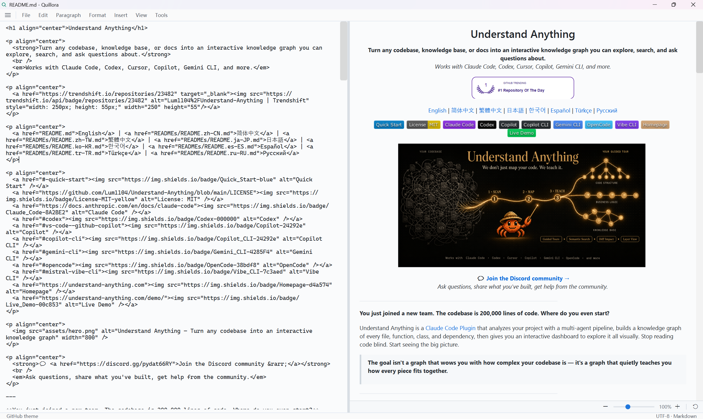
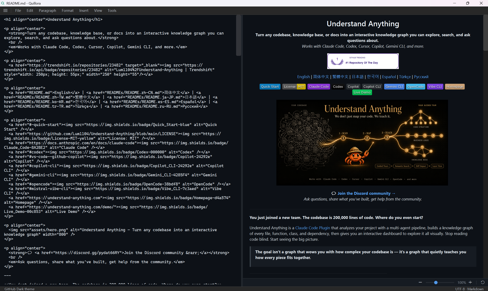
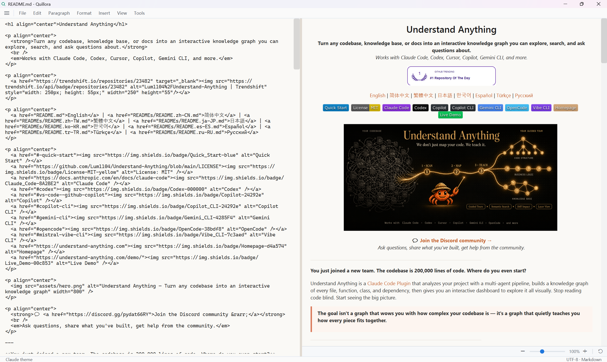

# Quillora

Quillora is a WPF Markdown workspace for writing, previewing, translating, and exporting documentation. It is built on .NET 8 and ships as both a desktop sample app and a reusable set of Markdown parsing, rendering, editor, and converter components.

[中文文档](README.zh-CN.md)

## Screenshots

### GitHub Light



### GitHub Dark



### Claude



## What Quillora Includes

- **Desktop Markdown editor** - A polished WPF sample app with file menus, recent files, quick open, folder sidebar, document outline, theme switching, localization, export, print, and translation workflows.
- **Reusable editor control** - `MarkdownEditor` provides two-way Markdown binding, source editing, live preview, formatting helpers, zoom controls, image paste support, and theme-aware UI.
- **Markdown renderer** - `FlowDocumentRenderer` turns parsed Markdown into WPF `FlowDocument` output for preview panes, chat bubbles, read-only views, or converter pipelines.
- **Parser and AST** - `WpfMarkdownEditor.Core` contains the UI-independent Markdown parser, block/inline model, and translation-safe segment extraction.
- **Converter bridge** - `WpfMarkdownEditor.Converters` adapts Markdown rendering to the `markitdown-csharp` conversion interface.

## Highlights

- **Live split preview** - Edit Markdown on the left and render a debounced preview on the right.
- **Clean Quillora branding** - Brand-only empty-window title, refreshed app icon, and installer metadata.
- **File workflows** - New/open/save/save as, open folder, recent files, quick open, move file, delete file, properties, show in sidebar, import text/Markdown, export HTML, and print.
- **Workspace sidebar** - File tree and outline tabs with animated show/hide behavior.
- **Markdown formatting** - Menu commands for headings, blockquote, ordered/bullet lists, bold, italic, strikethrough, inline code, links, code blocks, tables, and horizontal rules.
- **Smart editing** - List auto-continuation, ordered-list incrementing, Tab/Shift+Tab list indentation, empty-list cleanup, selection wrapping, and paste handling for clipboard images and image files.
- **Rendering coverage** - Headings, paragraphs, blockquotes, lists, tables, thematic breaks, inline styles, code blocks, local/remote images, SVG images, HTML image tags, linked image blocks, and responsive image sizing.
- **Syntax highlighting** - C#, JavaScript/TypeScript, Python, JSON/JSONC, SQL, and shell code blocks.
- **Translation preview** - Translate Markdown through Baidu Translate or OpenAI-compatible chat APIs while preserving Markdown structure and leaving the editor text unchanged.
- **Themes** - GitHub, GitHub Dark, Claude, Claude Dark, Light, and Dark, with theme-aware editor chrome and scrollbars.
- **Localization** - English and Simplified Chinese resources for the sample app.

## Run the App

Requirements:

- Windows 10/11
- .NET 8 SDK

```bash
git clone https://github.com/WenElevating/wpf-markdown-viewer.git
cd wpf-markdown-viewer
dotnet run --project samples/WpfMarkdownEditor.Sample/WpfMarkdownEditor.Sample.csproj
```

The sample app only depends on `WpfMarkdownEditor.Wpf` and `WpfMarkdownEditor.Core`, so it is the quickest way to try Quillora.

## Build and Test

```bash
# Build the reusable control and the sample app
dotnet build samples/WpfMarkdownEditor.Sample/WpfMarkdownEditor.Sample.csproj --no-restore

# Run WPF tests
dotnet test tests/WpfMarkdownEditor.Wpf.Tests/WpfMarkdownEditor.Wpf.Tests.csproj --no-restore

# Run Core parser/translation tests
dotnet test tests/WpfMarkdownEditor.Core.Tests/WpfMarkdownEditor.Core.Tests.csproj --no-restore
```

The full solution includes `WpfMarkdownEditor.Converters`, which currently references a sibling `markitdown-csharp` checkout. If you only cloned this repository, build the sample app or the Core/WPF projects directly.

## Use the Editor Control

Reference the projects from your WPF app:

```xml
<ItemGroup>
  <ProjectReference Include="path\to\WpfMarkdownEditor.Core\WpfMarkdownEditor.Core.csproj" />
  <ProjectReference Include="path\to\WpfMarkdownEditor.Wpf\WpfMarkdownEditor.Wpf.csproj" />
</ItemGroup>
```

Add the control in XAML:

```xml
<Window
    xmlns:ctrl="clr-namespace:WpfMarkdownEditor.Wpf.Controls;assembly=WpfMarkdownEditor.Wpf">
    <ctrl:MarkdownEditor
        x:Name="Editor"
        Markdown="# Hello Quillora"
        ShowPreview="True" />
</Window>
```

Use it from code:

```csharp
using WpfMarkdownEditor.Wpf.Theming;

Editor.LoadFile("README.md");
Editor.ApplyTheme(EditorTheme.GitHubDark);

Editor.MarkdownChanged += (_, e) =>
{
    Console.WriteLine($"Markdown changed: {e.NewMarkdown.Length} chars");
};
```

## Editor API Snapshot

### Dependency Properties

| Property | Type | Default | Description |
|---|---|---|---|
| `Markdown` | `string` | `""` | Markdown content with two-way binding. |
| `Theme` | `EditorTheme` | `Light` | Current editor and preview theme. |
| `ShowPreview` | `bool` | `true` | Shows or hides the preview pane. |
| `PreviewWidth` | `GridLength` | `1*` | Width of the preview pane. |

### Common Methods

| Method | Description |
|---|---|
| `LoadFile(string path)` | Loads Markdown and sets the document directory for relative images. |
| `SaveFileAsync(string path)` | Saves the current Markdown text. |
| `ApplyTheme(EditorTheme theme)` | Applies a built-in or custom theme. |
| `FocusEditor()` | Focuses the source editor. |
| `WrapSelection(string before, string after)` | Wraps the selected text with Markdown markers. |
| `InsertText(string text)` | Inserts text at the caret. |
| `ToggleLinePrefix(string prefix)` | Toggles heading, quote, or list prefixes on the current selection. |
| `RenderTranslatedPreview(string md)` | Renders translated Markdown in the preview pane only. |
| `ClearTranslatedPreview()` | Returns the preview to the editor content. |

### Events

| Event | Description |
|---|---|
| `MarkdownChanged` | Raised when editor text changes. |

## Rendering and Images

Quillora renders Markdown into WPF `FlowDocument` content. The renderer supports common Markdown blocks, GitHub-style tables, syntax-highlighted code blocks, inline formatting, and mixed Markdown/HTML image patterns.

Images can be loaded from:

- relative paths based on the current document directory
- absolute local paths
- remote URLs
- SVG data through the SVG browser fallback
- HTML ``, linked image, and `<picture>` fallback patterns

The image renderer uses stable placeholder hosts and refreshes layout when asynchronous images finish loading, which keeps the preview from jumping during updates.

## Translation

Translation is preview-only: the original Markdown in the editor is not overwritten.

Supported providers:

| Provider | Notes |
|---|---|
| Baidu Translate | Uses App ID and Secret Key. |
| OpenAI Compatible | Works with Qwen, DeepSeek, Zhipu, OpenAI, or any compatible chat completions endpoint. |

Supported target languages:

- English
- Chinese
- Japanese
- Korean

How translation preserves Markdown:

1. Parse Markdown into structured blocks and inline segments.
2. Extract only translatable text.
3. Replace inline Markdown markers with stable ASCII placeholders.
4. Translate clean text through the selected provider.
5. Reconstruct Markdown and render it in the preview pane.

Translation credentials are stored by the WPF layer using protected local settings.

## Themes

Built-in themes:

```csharp
Editor.ApplyTheme(EditorTheme.GitHub);
Editor.ApplyTheme(EditorTheme.GitHubDark);
Editor.ApplyTheme(EditorTheme.Claude);
Editor.ApplyTheme(EditorTheme.ClaudeDark);
Editor.ApplyTheme(EditorTheme.Light);
Editor.ApplyTheme(EditorTheme.Dark);
```

Custom themes are plain `EditorTheme` instances:

```csharp
var theme = new EditorTheme
{
    Name = "Docs",
    BackgroundColor = Colors.White,
    ForegroundColor = Colors.Black,
    BodyFont = new FontFamily("Segoe UI"),
    HeadingFont = new FontFamily("Segoe UI Semibold"),
    CodeFont = new FontFamily("Cascadia Mono, Consolas"),
    LinkColor = Colors.RoyalBlue,
    ParagraphSpacing = 14,
};

Editor.ApplyTheme(theme);
```

## Use the Renderer Directly

```csharp
using WpfMarkdownEditor.Core.Parsing;
using WpfMarkdownEditor.Wpf.Rendering;
using WpfMarkdownEditor.Wpf.Theming;

var parser = new MarkdownParser();
var renderer = new FlowDocumentRenderer(EditorTheme.ClaudeDark);

var blocks = parser.Parse(markdownText);
var document = renderer.Render(blocks);

PreviewViewer.Document = document;
```

## Converter Project

`WpfMarkdownEditor.Converters` adapts the renderer to the `markitdown-csharp` `IConverter` contract:

```csharp
using MarkItDown.Core;
using WpfMarkdownEditor.Converters;
using WpfMarkdownEditor.Wpf.Theming;

var converter = new MarkdownToFlowDocumentConverter(EditorTheme.GitHub);
var document = converter.ConvertToFlowDocument("# Hello");

var result = await converter.ConvertAsync(
    new DocumentConversionRequest { FilePath = "README.md" });
```

This project is useful when Markdown-to-WPF output needs to participate in a broader document conversion pipeline.

## Project Layout

```text
src/
  WpfMarkdownEditor.Core/         Markdown parser, AST, translation extraction
  WpfMarkdownEditor.Wpf/          WPF control, renderer, themes, localization, translation providers
  WpfMarkdownEditor.Converters/   MarkItDown bridge for Markdown -> FlowDocument
samples/
  WpfMarkdownEditor.Sample/       Quillora desktop app
tests/
  WpfMarkdownEditor.Core.Tests/       Parser and translation tests
  WpfMarkdownEditor.Wpf.Tests/        WPF control, rendering, services, localization tests
  WpfMarkdownEditor.Converters.Tests/ Converter tests
sources/
  en/ and zh/                     README screenshots by language
```

## Acknowledgments

- [markitdown](https://github.com/microsoft/markitdown) - Microsoft's document conversion project.
- [oh-my-claudecode](https://github.com/Yeachan-Heo/oh-my-claudecode) - Claude Code enhancement plugin.
- [Understand Anything](https://github.com/Lum1104/Understand-Anything) - README content used as the sample document.

## License

MIT
