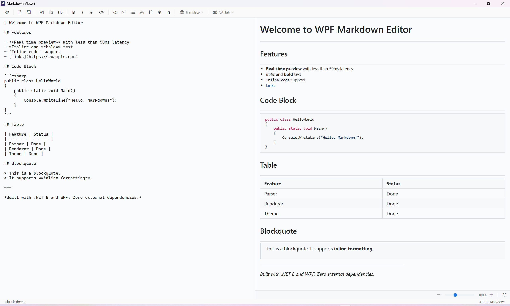
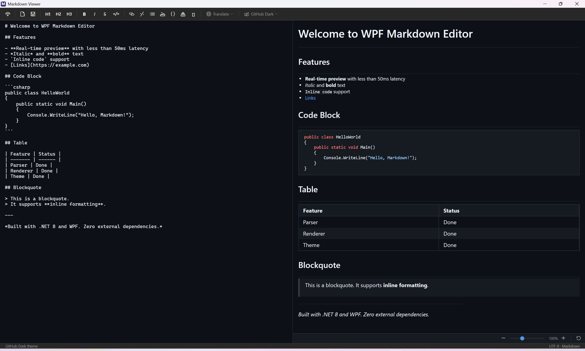
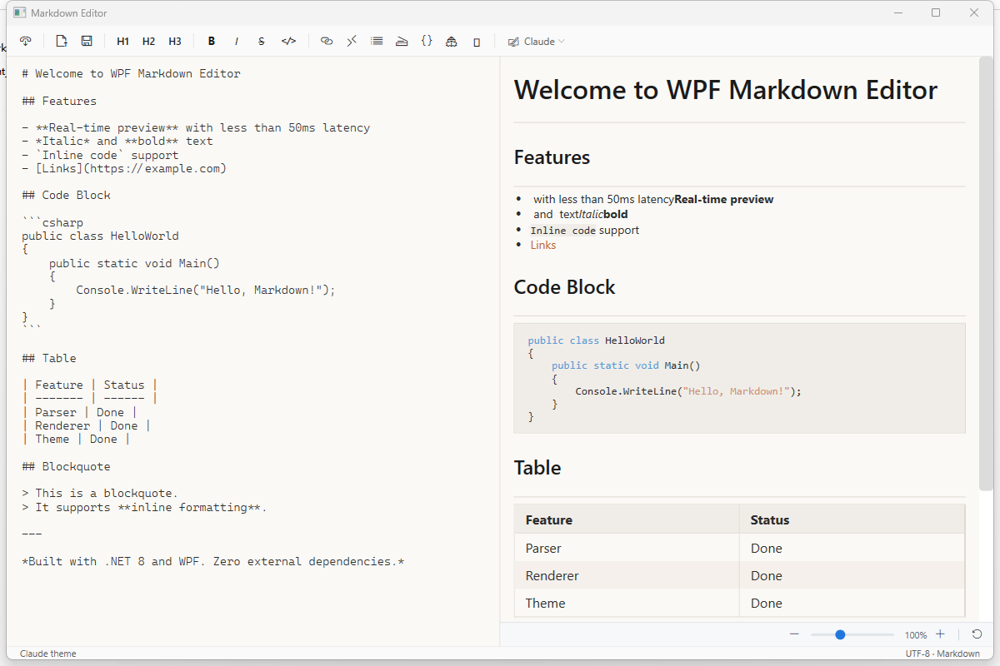

# WPF Markdown 编辑器

一个基于 .NET 8 的现代化、零依赖的 WPF Markdown 编辑器控件，支持实时预览。

[English](README.md)

## 功能特性

- **实时预览** — 左右分栏编辑，防抖渲染（~100ms）
- **多引擎翻译** — 通过百度或 OpenAI 兼容 API（通义千问、DeepSeek 等）翻译文档，仅预览模式保留原文
- **6 套内置主题** — GitHub、GitHub Dark、Claude、Claude Dark、Light、Dark
- **智能编辑** — 列表自动续行、前缀切换、选区包裹
- **格式化工具栏** — 标题、加粗、斜体、代码、链接、表格等
- **侧边栏** — 文件历史记录 & 文档大纲（TOC），支持动画切换
- **语法高亮** — 代码块支持 C#、JavaScript/TypeScript、Python、JSON/JSONC、SQL、Bash
- **零外部依赖** — 纯 WPF 实现，无需任何 NuGet 包

## 截图

### GitHub Light


### GitHub Dark


### Claude


## 快速开始

### 环境要求

- .NET 8.0 SDK
- Windows 10/11

### 安装

在你的 WPF 项目中添加 NuGet 包：

```xml
<ItemGroup>
  <PackageReference Include="WpfMarkdownEditor.Core" Version="0.1.0" />
  <PackageReference Include="WpfMarkdownEditor.Wpf" Version="0.1.0" />
</ItemGroup>
```

或直接引用项目：

```xml
<ItemGroup>
  <ProjectReference Include="path\to\WpfMarkdownEditor.Core\WpfMarkdownEditor.Core.csproj" />
  <ProjectReference Include="path\to\WpfMarkdownEditor.Wpf\WpfMarkdownEditor.Wpf.csproj" />
</ItemGroup>
```

### 快速上手

```xml
<Window xmlns:ctrl="clr-namespace:WpfMarkdownEditor.Wpf.Controls;assembly=WpfMarkdownEditor.Wpf">
    <ctrl:MarkdownEditor x:Name="Editor"
                         Markdown="# 你好 Markdown"
                         ShowPreview="True" />
</Window>
```

```csharp
// 加载文件
Editor.LoadFile("README.md");

// 应用主题
Editor.ApplyTheme(EditorTheme.GitHub);

// 监听内容变化
Editor.MarkdownChanged += (s, e) =>
{
    Console.WriteLine($"内容已变化（{e.NewMarkdown.Length} 字符）");
};
```

## API 参考

### 依赖属性

| 属性 | 类型 | 默认值 | 说明 |
|------|------|--------|------|
| `Markdown` | `string` | `""` | Markdown 内容（双向绑定） |
| `Theme` | `EditorTheme` | `Light` | 当前编辑器主题 |
| `ShowPreview` | `bool` | `true` | 显示/隐藏预览面板 |
| `PreviewWidth` | `GridLength` | `1*` | 预览面板宽度 |

### 方法

| 方法 | 说明 |
|------|------|
| `LoadFile(string path)` | 从文件加载 Markdown |
| `SaveFileAsync(string path)` | 保存 Markdown 到文件 |
| `ApplyTheme(EditorTheme theme)` | 应用主题 |
| `FocusEditor()` | 聚焦编辑器 |
| `WrapSelection(string before, string after)` | 用标记包裹选中文本 |
| `InsertText(string text)` | 在光标处插入文本 |
| `ToggleLinePrefix(string prefix)` | 切换标题/引用/列表前缀 |
| `RenderTranslatedPreview(string md)` | 在预览面板显示翻译后的 Markdown |
| `ClearTranslatedPreview()` | 恢复预览为编辑器内容 |

### 事件

| 事件 | 说明 |
|------|------|
| `MarkdownChanged` | Markdown 内容变化时触发 |

## 翻译

翻译 Markdown 文档，同时保留所有格式（标题、列表、表格、代码块、内联标记）。翻译结果仅在**预览面板**中显示，编辑器内容保持不变。

### 支持的翻译服务

| 服务 | 说明 |
|------|------|
| **百度翻译** | 百度翻译 API |
| **OpenAI 兼容** | 通义千问、DeepSeek、智谱、OpenAI 等兼容 Chat Completions API |

### 支持的语言

英语、中文（中文）、日语（日本語）、韩语（한국어）

### 工作原理

1. **模板提取** — 解析 Markdown，提取可翻译文本，用 ASCII 令牌替换内联标记
2. **翻译** — 将纯文本发送到翻译 API
3. **重建** — 用翻译文本恢复 Markdown 格式
4. **预览** — 在预览面板渲染翻译内容，编辑器内容不变

```csharp
// 翻译并在预览中显示
var service = new TranslationService(provider);
var result = await service.TranslateMarkdownAsync(
    Editor.Markdown, TranslationLanguage.Chinese, progress, ct);
Editor.RenderTranslatedPreview(result.TranslatedText);

// 清除翻译，恢复原文
Editor.ClearTranslatedPreview();
```

## 转换器

`WpfMarkdownEditor.Converters` 实现了 [markitdown-csharp](https://github.com/WenElevating/markitdown-csharp) 的 `IConverter` 接口，将 Markdown 转换为 WPF FlowDocument。

```csharp
using MarkItDown.Core;
using WpfMarkdownEditor.Converters;
using WpfMarkdownEditor.Wpf.Theming;

// 创建转换器（可指定主题）
var converter = new MarkdownToFlowDocumentConverter(EditorTheme.GitHub);

// 直接输出 FlowDocument 对象
var document = converter.ConvertToFlowDocument("# Hello World");

// 输出 XAML 字符串（通过 IConverter 接口）
var result = await converter.ConvertAsync(
    new DocumentConversionRequest { FilePath = "README.md" });
Console.WriteLine(result.Kind);     // "FlowDocument"
Console.WriteLine(result.Markdown);  // XAML 字符串
```

## 主题

六套内置主题，全部可自定义：

```csharp
// 内置主题
Editor.ApplyTheme(EditorTheme.GitHub);
Editor.ApplyTheme(EditorTheme.GitHubDark);
Editor.ApplyTheme(EditorTheme.Claude);
Editor.ApplyTheme(EditorTheme.ClaudeDark);
Editor.ApplyTheme(EditorTheme.Light);
Editor.ApplyTheme(EditorTheme.Dark);

// 自定义主题
var custom = new EditorTheme
{
    Name = "我的主题",
    BackgroundColor = Colors.White,
    ForegroundColor = Colors.Black,
    LinkColor = Colors.Blue,
    // ... 查看 EditorTheme 了解所有属性
};
Editor.ApplyTheme(custom);
```

## 智能编辑

编辑器提供智能 Markdown 编辑功能：

- **列表自动续行** — 在列表中按 Enter 自动插入下一个标记
- **有序列表递增** — `1.` → `2.` → `3.` 自动编号
- **Tab / Shift+Tab** — 列表项缩进/反缩进
- **空列表清理** — 在空列表项上按 Enter 删除标记

## 语法高亮支持

当前内置语言覆盖：

- **C#**：`csharp`、`cs`、`c#`
- **JavaScript / TypeScript**：`javascript`、`js`、`node`、`typescript`、`ts`、`jsx`、`tsx`
- **Python**：`python`、`py`、`py3`
- **JSON**：`json`、`jsonc`
- **SQL**：`sql`、`postgres`、`postgresql`、`mysql`、`sqlite`
- **Shell**：`bash`、`sh`、`shell`、`zsh`

## 格式化工具栏

示例应用包含完整的工具栏：

| 分类 | 操作 |
|------|------|
| 文件 | 打开、保存 |
| 标题 | H1、H2、H3 |
| 格式 | 加粗、斜体、删除线、行内代码 |
| 插入 | 链接、引用、无序列表、有序列表、代码块、表格、分隔线 |
| 主题 | 下拉选择器，包含全部 6 套主题 |
| 侧边栏 | 切换动画侧边栏 |

## 侧边栏

侧边栏提供两个标签页，支持动画显示/隐藏：

- **历史记录** — 最近打开的文件列表，显示时间戳，点击可重新打开
- **文档大纲** — 从当前 Markdown 提取的标题树结构

## 项目结构

```
src/
  WpfMarkdownEditor.Core/         — Markdown 解析器 & AST 模型 & 翻译提取
  WpfMarkdownEditor.Wpf/          — WPF 编辑器控件 & 渲染 & 翻译服务
  WpfMarkdownEditor.Converters/   — MarkItDown IConverter：Markdown → FlowDocument
samples/
  WpfMarkdownEditor.Sample/       — 示例应用
tests/
  WpfMarkdownEditor.Core.Tests/     — Core 单元测试
  WpfMarkdownEditor.Wpf.Tests/      — WPF 集成测试
  WpfMarkdownEditor.Converters.Tests/ — 转换器测试（19 个测试）
```

## 构建

```bash
git clone https://github.com/WenElevating/wpf-markdown-viewer.git
cd wpf-markdown-viewer
dotnet build
dotnet run --project samples/WpfMarkdownEditor.Sample
```

## 运行测试

```bash
dotnet test
```

## 致谢

- [markitdown](https://github.com/microsoft/markitdown) — Microsoft 的 Markdown 转换库
- [oh-my-claudecode](https://github.com/Yeachan-Heo/oh-my-claudecode) — Claude Code 增强插件

## 许可证

MIT
