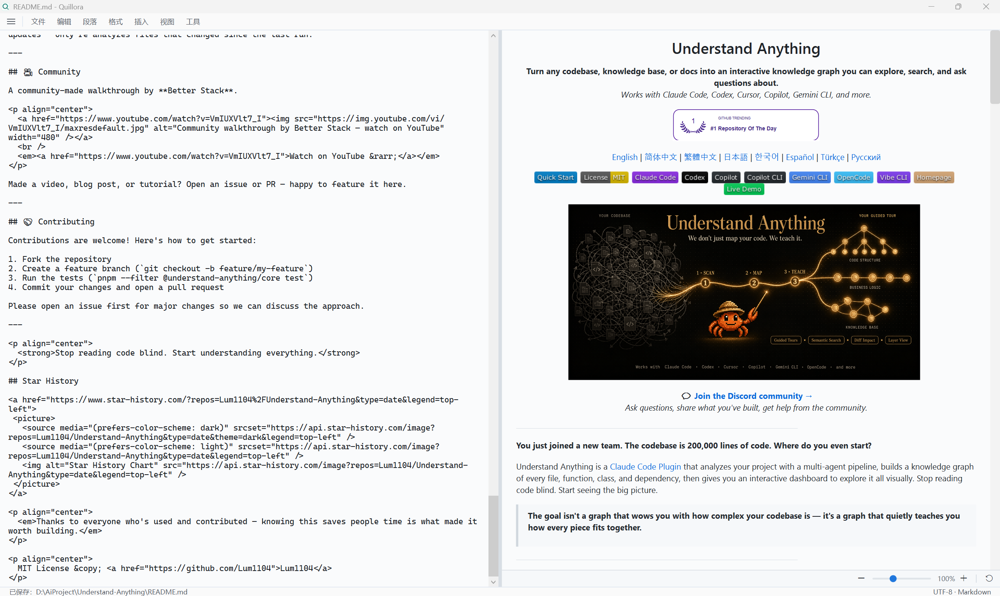
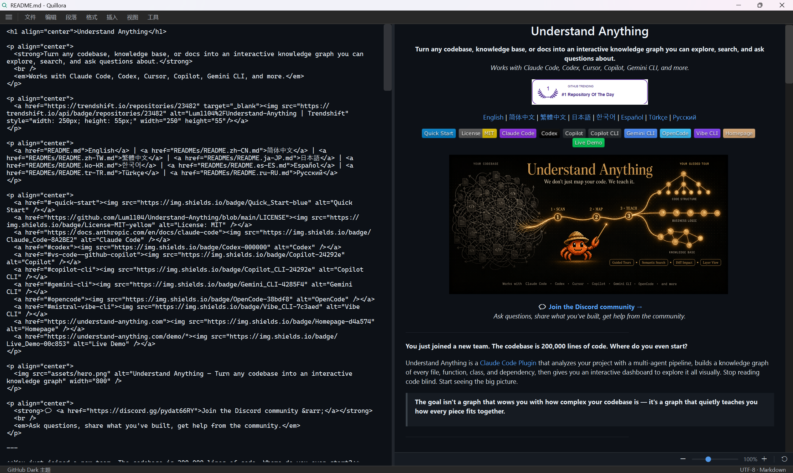
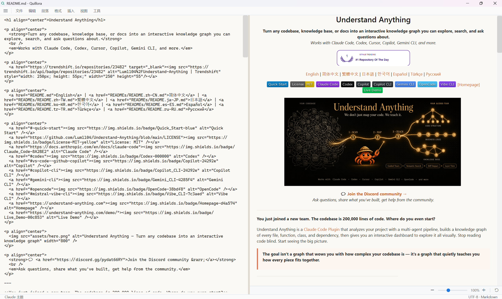

# Quillora

Quillora 是一个面向 WPF 的 Markdown 写作工作台，用于编辑、预览、翻译和导出文档。它基于 .NET 8 构建，同时提供可运行的桌面示例应用，以及可复用的 Markdown 解析、渲染、编辑器和转换组件。

[English](README.md)

## 截图

### GitHub Light



### GitHub Dark



### Claude



## Quillora 包含什么

- **桌面 Markdown 编辑器** - 一个完整的 WPF 示例应用，包含文件菜单、最近文件、快速打开、文件夹侧栏、文档大纲、主题切换、本地化、导出、打印和翻译流程。
- **可复用编辑器控件** - `MarkdownEditor` 提供 Markdown 双向绑定、源码编辑、实时预览、格式化辅助、缩放控件、图片粘贴和主题化界面。
- **Markdown 渲染器** - `FlowDocumentRenderer` 将 Markdown 渲染为 WPF `FlowDocument`，适合预览面板、只读内容、聊天气泡或转换管线。
- **解析器和 AST** - `WpfMarkdownEditor.Core` 包含不依赖 WPF 的 Markdown 解析器、块/行内模型，以及适合翻译的文本片段提取。
- **转换器桥接** - `WpfMarkdownEditor.Converters` 将 Markdown 渲染结果适配到 `markitdown-csharp` 的转换接口。

## 功能亮点

- **实时分栏预览** - 左侧编辑 Markdown，右侧防抖渲染预览。
- **Quillora 品牌化** - 空文档窗口只显示品牌名，包含新的应用图标和安装器元数据。
- **文件工作流** - 新建、打开、保存、另存为、打开文件夹、最近文件、快速打开、移动文件、删除文件、属性、在侧栏中显示、导入文本/Markdown、导出 HTML、打印。
- **工作区侧栏** - 文件树和文档大纲两个标签页，支持动画显示/隐藏。
- **Markdown 格式化** - 菜单支持标题、引用、有序/无序列表、加粗、斜体、删除线、行内代码、链接、代码块、表格和分隔线。
- **智能编辑** - 列表自动续行、有序列表递增、Tab/Shift+Tab 列表缩进、空列表清理、选区包裹、剪贴板图片和图片文件粘贴。
- **渲染能力** - 标题、段落、引用、列表、表格、分隔线、行内样式、代码块、本地/远程图片、SVG 图片、HTML 图片标签、链接图片块和响应式图片尺寸。
- **语法高亮** - C#、JavaScript/TypeScript、Python、JSON/JSONC、SQL 和 Shell 代码块。
- **翻译预览** - 通过百度翻译或 OpenAI 兼容 Chat API 翻译 Markdown，同时保留 Markdown 结构，且不覆盖编辑器原文。
- **主题** - GitHub、GitHub Dark、Claude、Claude Dark、Light、Dark，包含主题化的编辑器外观和滚动条。
- **本地化** - 示例应用内置英文和简体中文资源。

## 运行应用

环境要求：

- Windows 10/11
- .NET 8 SDK

```bash
git clone https://github.com/WenElevating/wpf-markdown-viewer.git
cd wpf-markdown-viewer
dotnet run --project samples/WpfMarkdownEditor.Sample/WpfMarkdownEditor.Sample.csproj
```

示例应用只依赖 `WpfMarkdownEditor.Wpf` 和 `WpfMarkdownEditor.Core`，是最快体验 Quillora 的方式。

## 构建和测试

```bash
# 构建可复用控件和示例应用
dotnet build samples/WpfMarkdownEditor.Sample/WpfMarkdownEditor.Sample.csproj --no-restore

# 运行 WPF 测试
dotnet test tests/WpfMarkdownEditor.Wpf.Tests/WpfMarkdownEditor.Wpf.Tests.csproj --no-restore

# 运行 Core 解析器/翻译测试
dotnet test tests/WpfMarkdownEditor.Core.Tests/WpfMarkdownEditor.Core.Tests.csproj --no-restore
```

完整 solution 包含 `WpfMarkdownEditor.Converters`，该项目当前引用同级目录中的 `markitdown-csharp` checkout。如果只克隆了本仓库，建议直接构建示例应用或 Core/WPF 项目。

## 使用编辑器控件

在你的 WPF 项目中引用源码项目：

```xml
<ItemGroup>
  <ProjectReference Include="path\to\WpfMarkdownEditor.Core\WpfMarkdownEditor.Core.csproj" />
  <ProjectReference Include="path\to\WpfMarkdownEditor.Wpf\WpfMarkdownEditor.Wpf.csproj" />
</ItemGroup>
```

在 XAML 中添加控件：

```xml
<Window
    xmlns:ctrl="clr-namespace:WpfMarkdownEditor.Wpf.Controls;assembly=WpfMarkdownEditor.Wpf">
    <ctrl:MarkdownEditor
        x:Name="Editor"
        Markdown="# Hello Quillora"
        ShowPreview="True" />
</Window>
```

在代码中使用：

```csharp
using WpfMarkdownEditor.Wpf.Theming;

Editor.LoadFile("README.md");
Editor.ApplyTheme(EditorTheme.GitHubDark);

Editor.MarkdownChanged += (_, e) =>
{
    Console.WriteLine($"Markdown 已变化：{e.NewMarkdown.Length} 字符");
};
```

## 编辑器 API 摘要

### 依赖属性

| 属性 | 类型 | 默认值 | 说明 |
|---|---|---|---|
| `Markdown` | `string` | `""` | Markdown 内容，支持双向绑定。 |
| `Theme` | `EditorTheme` | `Light` | 当前编辑器和预览主题。 |
| `ShowPreview` | `bool` | `true` | 显示或隐藏预览面板。 |
| `PreviewWidth` | `GridLength` | `1*` | 预览面板宽度。 |

### 常用方法

| 方法 | 说明 |
|---|---|
| `LoadFile(string path)` | 加载 Markdown，并设置相对图片的文档目录。 |
| `SaveFileAsync(string path)` | 保存当前 Markdown 文本。 |
| `ApplyTheme(EditorTheme theme)` | 应用内置或自定义主题。 |
| `FocusEditor()` | 聚焦源码编辑器。 |
| `WrapSelection(string before, string after)` | 用 Markdown 标记包裹选区。 |
| `InsertText(string text)` | 在光标处插入文本。 |
| `ToggleLinePrefix(string prefix)` | 对当前选区切换标题、引用或列表前缀。 |
| `RenderTranslatedPreview(string md)` | 仅在预览面板渲染翻译后的 Markdown。 |
| `ClearTranslatedPreview()` | 将预览恢复为编辑器内容。 |

### 事件

| 事件 | 说明 |
|---|---|
| `MarkdownChanged` | 编辑器文本变化时触发。 |

## 渲染和图片

Quillora 将 Markdown 渲染为 WPF `FlowDocument`。渲染器支持常见 Markdown 块、GitHub 风格表格、语法高亮代码块、行内格式，以及 Markdown/HTML 混合图片场景。

图片来源支持：

- 基于当前文档目录的相对路径
- 本地绝对路径
- 远程 URL
- 通过 SVG 浏览器 fallback 显示 SVG 数据
- HTML ``、链接图片和 `<picture>` fallback 模式

图片渲染使用稳定的占位容器，并在异步图片加载完成后刷新布局，减少预览更新时的跳动。

## 翻译

翻译是预览模式：编辑器中的原始 Markdown 不会被覆盖。

支持的服务：

| 服务 | 说明 |
|---|---|
| 百度翻译 | 使用 App ID 和 Secret Key。 |
| OpenAI 兼容 | 适配通义千问、DeepSeek、智谱、OpenAI 或其他兼容 Chat Completions 的接口。 |

支持的目标语言：

- 英文
- 中文
- 日文
- 韩文

Markdown 保真流程：

1. 将 Markdown 解析为结构化块和行内片段。
2. 只提取可翻译文本。
3. 用稳定的 ASCII 占位符替换行内 Markdown 标记。
4. 通过选定服务翻译干净文本。
5. 重建 Markdown，并在预览面板渲染。

翻译凭据由 WPF 层通过本地受保护设置保存。

## 主题

内置主题：

```csharp
Editor.ApplyTheme(EditorTheme.GitHub);
Editor.ApplyTheme(EditorTheme.GitHubDark);
Editor.ApplyTheme(EditorTheme.Claude);
Editor.ApplyTheme(EditorTheme.ClaudeDark);
Editor.ApplyTheme(EditorTheme.Light);
Editor.ApplyTheme(EditorTheme.Dark);
```

自定义主题就是普通的 `EditorTheme` 实例：

```csharp
var theme = new EditorTheme
{
    Name = "Docs",
    BackgroundColor = Colors.White,
    ForegroundColor = Colors.Black,
    BodyFont = new FontFamily("Segoe UI"),
    HeadingFont = new FontFamily("Segoe UI Semibold"),
    CodeFont = new FontFamily("Cascadia Mono, Consolas"),
    LinkColor = Colors.RoyalBlue,
    ParagraphSpacing = 14,
};

Editor.ApplyTheme(theme);
```

## 直接使用渲染器

```csharp
using WpfMarkdownEditor.Core.Parsing;
using WpfMarkdownEditor.Wpf.Rendering;
using WpfMarkdownEditor.Wpf.Theming;

var parser = new MarkdownParser();
var renderer = new FlowDocumentRenderer(EditorTheme.ClaudeDark);

var blocks = parser.Parse(markdownText);
var document = renderer.Render(blocks);

PreviewViewer.Document = document;
```

## Converter 项目

`WpfMarkdownEditor.Converters` 将渲染器适配到 `markitdown-csharp` 的 `IConverter` 契约：

```csharp
using MarkItDown.Core;
using WpfMarkdownEditor.Converters;
using WpfMarkdownEditor.Wpf.Theming;

var converter = new MarkdownToFlowDocumentConverter(EditorTheme.GitHub);
var document = converter.ConvertToFlowDocument("# Hello");

var result = await converter.ConvertAsync(
    new DocumentConversionRequest { FilePath = "README.md" });
```

当你需要让 Markdown-to-WPF 输出进入更大的文档转换管线时，这个项目会比较有用。

## 项目结构

```text
src/
  WpfMarkdownEditor.Core/         Markdown 解析器、AST、翻译提取
  WpfMarkdownEditor.Wpf/          WPF 控件、渲染器、主题、本地化、翻译服务
  WpfMarkdownEditor.Converters/   MarkItDown 桥接：Markdown -> FlowDocument
samples/
  WpfMarkdownEditor.Sample/       Quillora 桌面应用
tests/
  WpfMarkdownEditor.Core.Tests/       解析器和翻译测试
  WpfMarkdownEditor.Wpf.Tests/        WPF 控件、渲染、服务、本地化测试
  WpfMarkdownEditor.Converters.Tests/ 转换器测试
sources/
  en/ 和 zh/                     README 截图，按语言存放
```

## 致谢

- [markitdown](https://github.com/microsoft/markitdown) - Microsoft 的文档转换项目。
- [oh-my-claudecode](https://github.com/Yeachan-Heo/oh-my-claudecode) - Claude Code 增强插件。
- [Understand Anything](https://github.com/Lum1104/Understand-Anything) - 示例文档使用了该项目的 README 内容。

## 许可证

MIT
